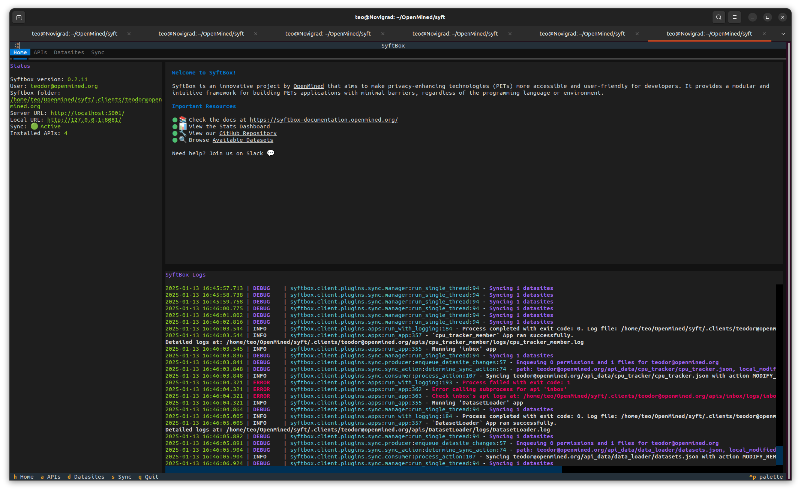

## Highlights

### Textual UI

In this release we have started experimenting with new ways to improve the user experience as we are aware the main
blocker for most people to use our library is a trustworthy interface. 

The first step in this regard is a GUI using [Textual](https://textual.textualize.io/) which will have all the information
you might need as a `SyftBox` user (Logs, Tutorials, APIs, FileSystem and more), neatly organized and easily accessible. 

You can try it by running the following command:

```
syftbox tui --config path/to/syftbox/config.json
```

You need to clone our repo and have a client already running. Here is a preview in case you are not convinced yet:



If you have any suggestion on how we can improve it or on what you are expecting it to allow users to do, we are open to
new ideas. You can help us either by sending us a [slack message](https://openmined.slack.com/ssb/redirect) or by opening a [Github issue](https://github.com/OpenMined/syft/issues).

### Permisssions

We have updated our way of dealing with permissions in order to allow for better user control. If you checked your 
datasite's folder after updating, you will probably already have noticed you have a `syftperm.yaml` file instead of the
legacy `_.syftperm`. Here is a comparision between the two of them:

<div style="display: flex; gap: 20px;">

  <div style="flex: 1;">
    <strong>_.syftperm:</strong>
    <pre>{
    "admin": ["teodor@openmined.org"], 
    "read": ["teodor@openmined.org"], 
    "write": ["teodor@openmined.org"], 
    "filepath": "/home/teo/Desktop/SyftBox/teodor@openmined.org/_.syftperm", 
    "terminal": false
}
    </pre>
  </div>

  <div style="flex: 1;">
    <strong>syftperm.yaml:</strong>
    <pre>
- path: '**'
    permissions:
    - admin
    - create
    - write
    - read
    user: teodor@openmined.org
  </pre>
  </div></div>

As you can see we have new rule based-permissions that allow an owner of a `SyftBox` to define
which users can access their files. These new rules will help use scale our infrastructure
and improve requests response time while providing greater clarity for the users over access rights.

If you want to read more on these changes, please consult: [this document](permissions.md) 

### Breaking Changes

With the new permissions update, you will need to update your apps making the following change when trying to access
the permission for a client:

```diff
- permission = SyftPermission.mine_with_public_write(client.email)
+ permission = SyftPermission.mine_with_public_write(context=client, dir=path)
```

Ignoring this change will break any app you have already developed so please take note.


# Changelog

## New Features
- **Sync Plugin for Dashboard**: Prepared the sync plugin for dashboard integration. ([#440](https://github.com/OpenMined/syft/pull/440))
- **Streaming Bulk Downloads**: Added support for streaming bulk downloads. ([#507](https://github.com/OpenMined/syft/pull/507))
- **Permission Management**: Implemented permissions and rejection logic for Consumer. ([#465](https://github.com/OpenMined/syft/pull/465))
- **Telemetry Enhancements**: Added OS name, version, and architecture to telemetry. ([#495](https://github.com/OpenMined/syft/pull/495))
- **Textual TUI Prototype**: Introduced a prototype for a Textual TUI. ([#508](https://github.com/OpenMined/syft/pull/508))
- **Default App**: Added `cpu_tracker` as a default app. ([#466](https://github.com/OpenMined/syft/pull/466))

## Improvements
- **Client Version Check**: Added version validation on startup and OS logging to analytics. ([#451](https://github.com/OpenMined/syft/pull/451))
- **Path Alias Support**: Introduced a path alias for `file_path` in `LocalState`. ([#452](https://github.com/OpenMined/syft/pull/452))
- **Server Communication Enhancements**: Renamed client-side components and added a client for server communication. ([#467](https://github.com/OpenMined/syft/pull/467))
- **Mypy Integration**: Enabled mypy for static type checking. ([#419](https://github.com/OpenMined/syft/pull/419))
- **Lean Builds**: Migrated to `hatchling` for leaner builds. ([#503](https://github.com/OpenMined/syft/pull/503))

## Fixes
- **E2E Test Stability**: Fixed flaky end-to-end tests. ([#448](https://github.com/OpenMined/syft/pull/448))
- **Client Shutdown**: Addressed issues with client shutdown handling. ([#457](https://github.com/OpenMined/syft/pull/457))
- **Symlink Race Condition**: Resolved a race condition with symlinks. ([#453](https://github.com/OpenMined/syft/pull/453))
- **Staging Issues**: Applied fixes to staging environments. ([#491](https://github.com/OpenMined/syft/pull/491), [#519](https://github.com/OpenMined/syft/pull/519))
- **Public Write Method**: Corrected logic in the public write method. ([#493](https://github.com/OpenMined/syft/pull/493))

## Refactoring and Cleanup
- **Sync Refactor**: Refactored sync endpoints and cleaned up sync-related code. ([#443](https://github.com/OpenMined/syft/pull/443), [#460](https://github.com/OpenMined/syft/pull/460))
- **Repo Cleanup**: Performed repository-wide cleanup and maintenance. ([#475](https://github.com/OpenMined/syft/pull/475))
- **Pin Versions**: Pinned dependencies to specific versions. ([#478](https://github.com/OpenMined/syft/pull/478))

## Dependency Updates
- **`pyjwt`**: Bumped from 2.10.0 to 2.10.1. ([#477](https://github.com/OpenMined/syft/pull/477))
- **`python-multipart`**: Bumped from 0.0.12 to 0.0.19. ([#476](https://github.com/OpenMined/syft/pull/476))

## Miscellaneous
- **OTEL Instrumentation**: Added FastAPI OTEL instrumentation (disabled by default). ([#468](https://github.com/OpenMined/syft/pull/468), [#496](https://github.com/OpenMined/syft/pull/496))
- **Benchmarking**: Added benchmark metrics and reports. ([#504](https://github.com/OpenMined/syft/pull/504), [#463](https://github.com/OpenMined/syft/pull/463))
- **Server Configurations**: Introduced a server request size limit and migration handling. ([#512](https://github.com/OpenMined/syft/pull/512), [#498](https://github.com/OpenMined/syft/pull/498))


**Full Changelog**: https://github.com/OpenMined/syft/compare/0.2.11...0.2.12


